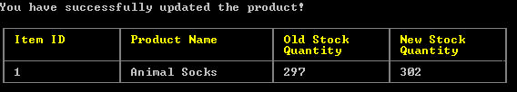

# Bamazon
Bamazon is a node application that allows customers, managers, and supervisors to interact with products from a MySQL database. Customers can buy different products. Managers can view products for sale, view products with a low inventory, view department names, add to inventory of a product, and add new products. Supervisors can view products sales by department and create new departments.

## Table of Contents
* [Installation and Instructions For Bamazon](#installation-and-instructions-for-bamazon)
* [Customer](#customer)
	* [View Products](#view-products)
* [Manager](#manager)
	* [View Products For Sale](#view-products-for-sale)
	* [View Low Inventory](#view-low-inventory)
	* [View Departments](#view-departments)
	* [Add to Inventory](#add-to-inventory)
	* [Add New Product](#add-new-product)
* [Supervisor](#supervisor)
	* [View Product Sales by Department](#view-product-sales-by-department)
	* [Create New Department](#create-new-department)

## Installation and Instructions For Bamazon
1. User must first install the needed packages to use the application by using `npm install`.
* The following packages are used in this application: `mysql`, `inquirer`, `cli-table2`.
2. Create a database using the `bamazon.sql` file.
3. Start one of the following js files using node:
`bamazonCustomer.js`, `bamazonManager.js`, `bamazonSupervisor.js`
Example using command line: `node bamazonCustomer.js`
4. Go to appropriate section in this readme.

## Customer
1. The customer is prompted with 2 options.

* Choose the `View Products` option to view all available products for sale from bamazon.
* Choose the `Exit Application` option to exit the application.

### View Products
Below is an example of when you choose `View Products`.

1. The customer can look at the different products' id, name, and price.
2. After the customer is done viewing, they can answer the new questions at the bottom of the products table.

	`Which product would you like to buy? <Enter Item ID>`
	* Answer this question by entering the Item ID of the product you wish to buy. Please enter in whole numbers only.
3. Another question will show after answering which product you want.

	`How many units of the product would you like to buy?`
	* Answer this question by entering the number of units you would like to buy. Please enter in whole numbers only.
	* If there are not enough units of the product left that the customer wants or if there is no more stock, the customer will be asked if they want to buy another product.
* (All questions' answers are checked for validity. I.e. Only enter whole numbers. User will be prompted again if they entered an invalid answer) 
* Example of both questions answered below:

4. After answering both questions successfully, a reciept will be shown if the order has successfully went through. Example below:

5. The customer is then asked if they would like to buy another product. Example below:

* Choose `Yes` to look at the products again and buy another product.
* Choose `No` to exit the application.

## Manager
1. The manager is prompted with 6 options.

* Choose the `View Products For Sale` option to view all the available products for sale from bamazon.
* Choose the `View Low Inventory` option to view all products with a stock quantity less than 5.
* Choose the `View Departments` option to view all department names.
* Choose the `Add to Inventory` option to add more inventory/stock to a product.
* Choose the `Add New Product` option to add a new product.
* Choose the `Exit Application` option to exit the application.

* After going through an option and its steps, the manager options will be shown again

### View Products For Sale
Below is example of when you choose `View Products For Sale`.

* Item ID, product name, department, price, and stock quantity of each product is shown.

### View Low Inventory
Below is example of when you choose `View Low Inventory`.

* Item ID, product name, department, price, and stock quantity of each product with a stock quantity less than 5 is shown.

### View Departments
Below is example of when you choose `View Departments`.

* Department ID and department name of each department is shown.

### Add to Inventory
* The manager will be asked 2 questions.
1. `Which product would you like to add more stock to? <Enter Item ID>`
	* Answer this question by entering the Item ID of the product you would like to add more stock to. Please enter only whole numbers.
2. `How many units of the product would you like to add?`
	* Answer this question by entering the number of units of stock you would like to add. Please enter only whole numbers.
* (All questions' answers are checked for validity. I.e. Only enter whole numbers. User will be prompted again if they entered an invalid answer) 

Example of questions answered below:

3. After answering the questions successfully, the results will be shown if the product's stock was successfully updated. Example below:

### Add New Product
* The manager will be asked 4 questions.
1. `Enter the product's name`
	* Answer this question by entering the name of the product you would like to add.
2. `Enter the department's name?`
	* Answer this question by entering the name of an existing department.
3. `Enter the price of the product`
	* Answer this question by entering the price you wish to sell the product at. Please enter only numbers.
4. `Enter the stock quantity`
	* Answer this question by entering the stock quantity you currently have of the product. Please enter only whole numbers.
* (All questions' answers are checked for validity. I.e. Only enter whole numbers. User will be prompted again if they entered an invalid answer)  

Example of questions answered below:

5. After answering the questions successfully, the results will be shown if the product was successfully created. Example below:

## Supervisor
1. The supervisor is prompted with 3 options.

* Choose the `View Product Sales by Department` option to view the product sales by department.
* Choose the `Create New Department` option to create a new department.
* Choose the `Exit Application` option to exit the application.

* After going through an option and its steps, the manager options will be shown again

### View Product Sales by Department
Below is example of when you choose `View Product Sales by Department`.

* Department ID, department name, over head costs, product sales, and total profit of each department is shown.
* Departments are ordered by total profit descending.

### Create New Department
* The supervisor will be asked 1 question.
1. `Enter the department's name`
	* Answer this question by entering a department name that does not already exist.
* (All questions' answers are checked for validity. I.e. Only enter whole numbers. User will be prompted again if they entered an invalid answer)

Below is an example of the question answered:

2. After the question is successfully answered, the results will be shown if the department was successfully created. Example below:

